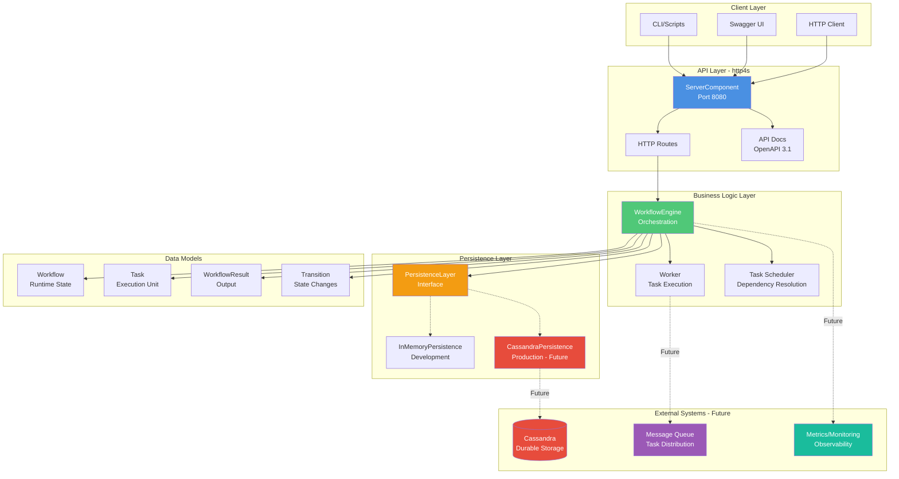
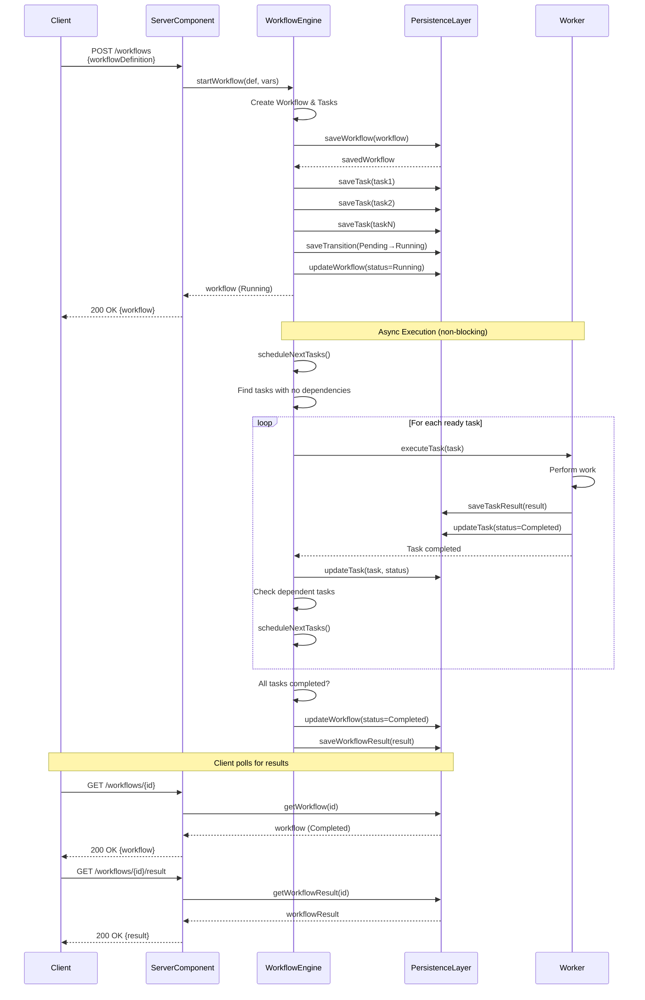
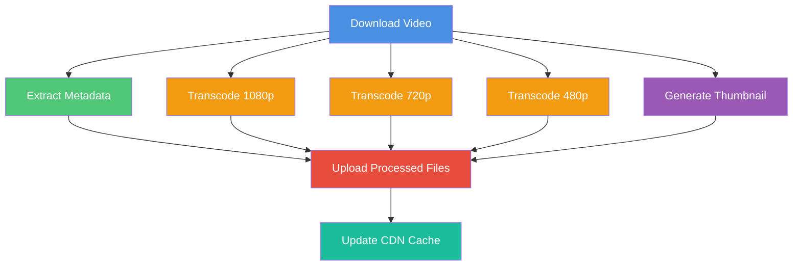

# Workflow Engine - Visual Diagrams

This document contains visual diagrams to help understand the workflow engine architecture and execution flow.

## System Architecture Diagram

## Workflow Execution Sequence

## Task Dependency Graph Example

## Parallel Execution Example (Video Processing)

Note: Tasks C, D, E, F execute in parallel after A completes.

